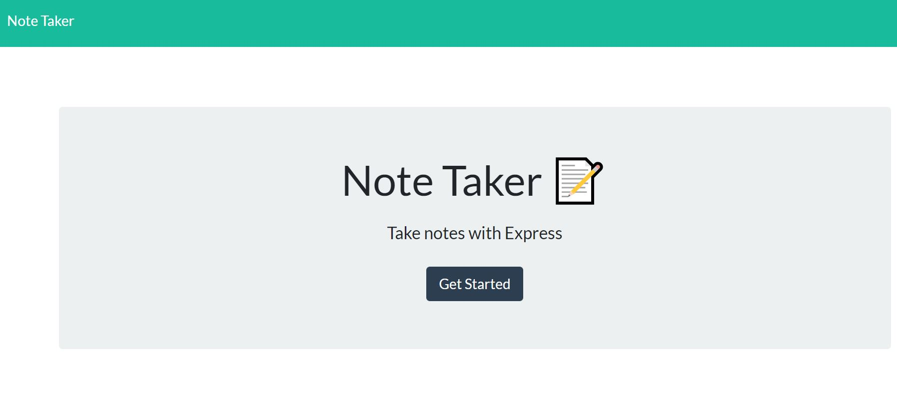

# Note Taker
  
  ## Description

  An application that can be used to write and save notes.
  
  ## Table of Contents

  * [Installation](#installation)
  * [Usage](#usage)
  * [License](#license)
  * [Contributing](#contributing)
  * [Tests](#tests)
  * [GitHub](#github)
  
  ## Installation

  The application uses express.js to build the back end data storage.

  ## Usage
  Using the application from the deployed Heroku landing page select 'Get Started', this will lead you to a new page to create new notes, as well as displaying any notes that have been saved previously.  
  
  

  ## License
        
      This project uses [No License]
  
  ## Contributing

  Starter code was provided for the front end, all back end code written by me.  
  
  ## Tests

  To test applcation go to https://notetakr-af.herokuapp.com/ or to test locally type `npm start` from the command line.
  
  ## Questions
  
  Reach out via email or GitHub.  
  adamflynn1@gmail.com  
  [adamjflynn/note-taker](https://github.com/adamjflynn/note-taker/)